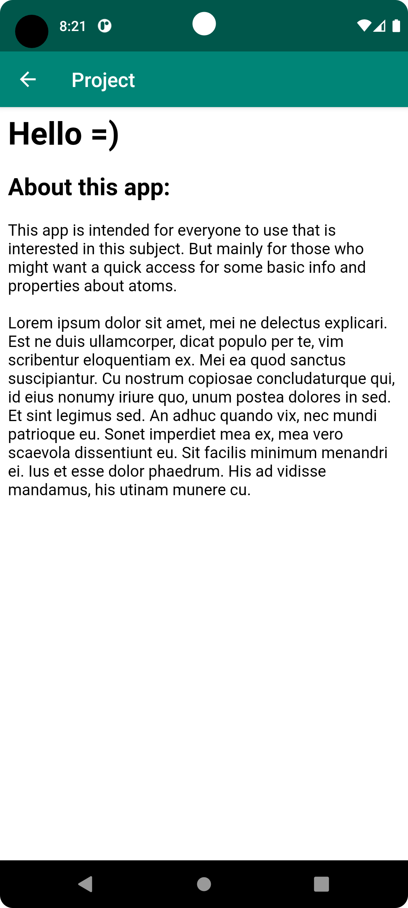

# Rapport

Forked the project from lenaSys.

ABOUT-button:

At first I created an about-button in activity_main.
Then I created a new html-asset which I called about.html
I created a second activity named "About" where a web-view was placed in its xml.
The about button got an onlicklistener to start a new intent which starts the about-activity.
Below codes show how it's done;

```
 about.setOnClickListener(new View.OnClickListener() {
            @Override
            public void onClick(View view) {
                Intent intent = new Intent(MainActivity.this, About.class);
                startActivity(intent);
            }
        });
```

RecyclerView:

Then a recyclerview with corresponding adapter and items was implemented.
I added the recyclerview to the main activity.
Belonging Recyclerview_item.xml was created.

JsonTask
I copied the code you gave me from github.

Atom is my RecyclerViewItem.
I created some constructors and getter and setters in this class.
To see that my recyclerview works I made an arraylist with atoms for it to show.

Lastly I added the necessary data to the web-service and database for my app
to retrieve with JsonTask .

To be able to retrieve data from the internet I had to allow internet-access in
Android-manifest.

On execution it worked but it didn't show the data I wanted in the right text-fields.
With help of SerializedName() I could retrieve the data I wanted for the correct Variable.
I wanted to sort the list by Alphabetic-Name.
So I sorted the list on postExecution with this code.

```
 Collections.sort(atomList, new Comparator<Atom>() {
            @Override
            public int compare(Atom a1, Atom a2) {
                return a1.getName().compareTo(a2.getName());
            }
        });
```
If I wanted to sort the list by other properties, I'll just change getmethod to something else.

To make my RecyclerView show multiple fields of data I added 3 textfields to the recyclerviewitem layout.


As mentioned my About-activity uses a web-view which uses a few html-codes for bigger text.
I made my Main-activity parent for ease to go back.




