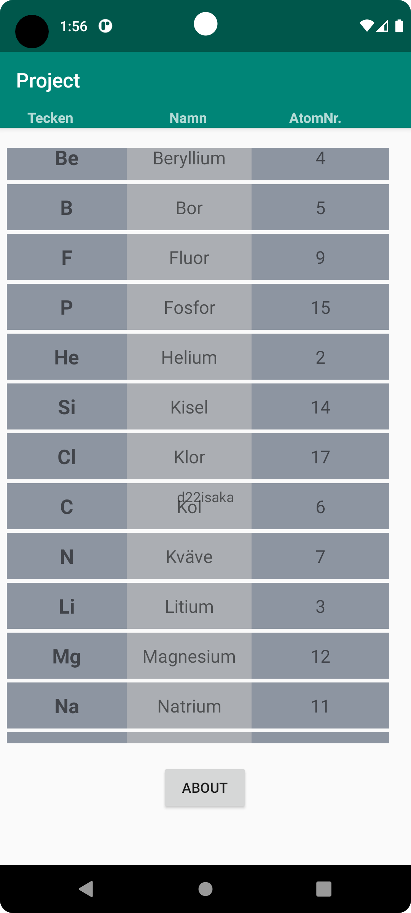

# Rapport

Forked the project from lenaSys.

ABOUT-button:

At first I created an about-button in activity_main.
Then I created a new html-asset which I called about.html
I created a second activity named "About" where a webview was placed in its xml.
The about button got an onlicklistener to start a new intent which starts the about-activity.
Below codes show how it's done;

```
 about.setOnClickListener(new View.OnClickListener() {
            @Override
            public void onClick(View view) {
                Intent intent = new Intent(MainActivity.this, About.class);
                startActivity(intent);
            }
        });
```

RecyclerView:

Then a recyclerview with corresponding adapter and items was implemented.
I added the recyclerview to the main activity.
Belonging Recyclerview_item.xml was created.

JsonTask
I copied the code you gave me from github.

Atom is my RecyclerViewItem.
I created some constructors and getter and setters in this class.
To see that my recyclerview works I made an arraylist with atoms for it to show.

Lastly I added the necessary data to the web-service and database for my app
to retrieve with JsonTask .

On execution it worked but it didn't show the data I wanted.
With help of SerializedName() I could add the data I wanted for the correct Variable.
I wanted to sort the list by Alphabetic-Name.
So I sorted the list on postExecution with this code.

```
 Collections.sort(atomList, new Comparator<Atom>() {
            @Override
            public int compare(Atom a1, Atom a2) {
                return a1.getName().compareTo(a2.getName());
            }
        });
```

To make my RecyclerView show multiple fields of data I added 3 textfields to the recyclerviewitem layout.




## Följande grundsyn gäller dugga-svar:

- Ett kortfattat svar är att föredra. Svar som är längre än en sida text (skärmdumpar och programkod exkluderat) är onödigt långt.
- Svaret skall ha minst en snutt programkod.
- Svaret skall inkludera en kort övergripande förklarande text som redogör för vad respektive snutt programkod gör eller som svarar på annan teorifråga.
- Svaret skall ha minst en skärmdump. Skärmdumpar skall illustrera exekvering av relevant programkod. Eventuell text i skärmdumpar måste vara läsbar.
- I de fall detta efterfrågas, dela upp delar av ditt svar i för- och nackdelar. Dina för- respektive nackdelar skall vara i form av punktlistor med kortare stycken (3-4 meningar).

Programkod ska se ut som exemplet nedan. Koden måste vara korrekt indenterad då den blir lättare att läsa vilket gör det lättare att hitta syntaktiska fel.

```
 Collections.sort(atomList, new Comparator<Atom>() {
            @Override
            public int compare(Atom a1, Atom a2) {
                return a1.getName().compareTo(a2.getName());
            }
        });
```

Bilder läggs i samma mapp som markdown-filen.


Läs gärna:

- Boulos, M.N.K., Warren, J., Gong, J. & Yue, P. (2010) Web GIS in practice VIII: HTML5 and the canvas element for interactive online mapping. International journal of health geographics 9, 14. Shin, Y. &
- Wunsche, B.C. (2013) A smartphone-based golf simulation exercise game for supporting arthritis patients. 2013 28th International Conference of Image and Vision Computing New Zealand (IVCNZ), IEEE, pp. 459–464.
- Wohlin, C., Runeson, P., Höst, M., Ohlsson, M.C., Regnell, B., Wesslén, A. (2012) Experimentation in Software Engineering, Berlin, Heidelberg: Springer Berlin Heidelberg.
